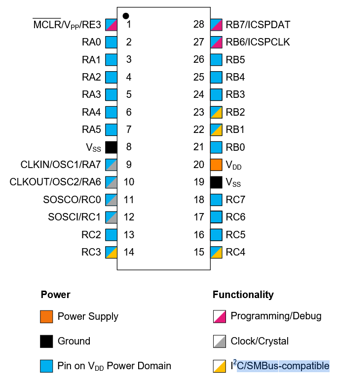
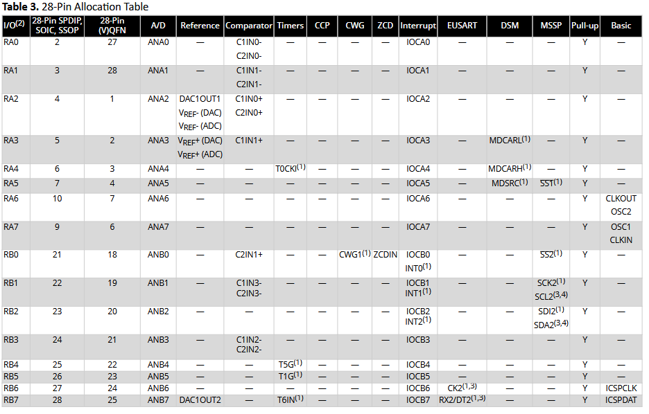
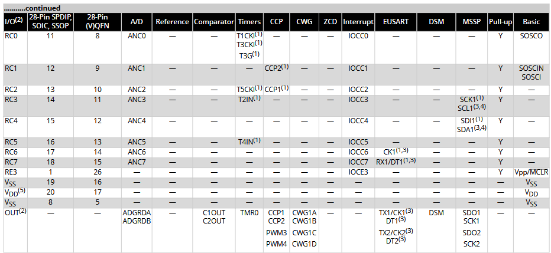

| ESP Info                                      | Answer | Notes                                                                                                      |
| --------------------------------------------- | ------ | --------------------------------------------------------------------------------------------------------- |
| Model                                         | PIC18F27Q10     | 27pin soic           |
| Product Page URL                              | [Microchip](https://www.microchip.com/en-us/product/PIC18F27Q10)      |                                             |
| Datasheet URL(s)                              | [Datasheet](https://ww1.microchip.com/downloads/aemDocuments/documents/MCU08/ProductDocuments/DataSheets/PIC18F27-47Q10-Micorcontroller-Data-Sheet-DS40002043.pdf)      |                                               |
| Application Notes URL(s)                      | [Datasheet](https://ww1.microchip.com/downloads/aemDocuments/documents/MCU08/ApplicationNotes/ApplicationNotes/Getting-Started-with-UART-Using-EUSART-on-PIC18-90003282A.pdf)      |                                             |
| Vendor link                                   | [Digikey](https://www.digikey.com/en/products/detail/microchip-technology/PIC18F27Q10-I-SO/10064343)      | Digikey, Jameco, etc.                        |
| Code Examples                                 | [Code](https://mplabxpress.microchip.com/mplabcloud/example?device=q10)      |  |
| External Resources URL(s)                     |       |                         |
| Unit cost                                     |  $1.31  |                                                             |
| Absolute Maximum Current for entire IC        |   250 mA |                                                                      |
| Supply Voltage Range                          |  1.8V / 3.3V / 5.5V  |  3.3v chosen                                              |
| Maximum GPIO current   (per pin)           |  25mA  |                                                                                   |
| Supports External Interrupts?                 | yes     |                                                                                     |
| Required Programming Hardware, Cost, URL      | Mpxlab(link)     |                                                               |
| Works with MPLabX?                            | yes      |                  |
| Works with Microchip Code Configurator?       | yes      |                                                       |

| Module | # Available | Needed | Associated Pins (or * for any) |
| ---------- | ----------- | ------ | ------------------------------ |
| GPIO       | 25           | 1      | Pins 2-7, 9-13, 17-28                              |
| ADC        | 24          | 2      | Pins 2-7, 13, 25, 26, 27                              |
| UART       |  2          | 2      | Pins 17 (TX1), 18 (RX1), 27 (TX2), 28 (RX2                              |
| SPI        | 2           | 0      | Pins 14 (SCK1), 15 (SDI1), 16 (SDO1), 21 (SS2), 22 (SCK2), 23 (SDI2), 24 (SDO2), 26 (SS1)                              |
| I2C        | 2           | 1      | Pins 14 (SCL1), 15 (SDA1), 22 (SCL2), 23 (SDA2)                              |
| PWM        | 3           | 0      | Pins 6, 7, 13                              |

