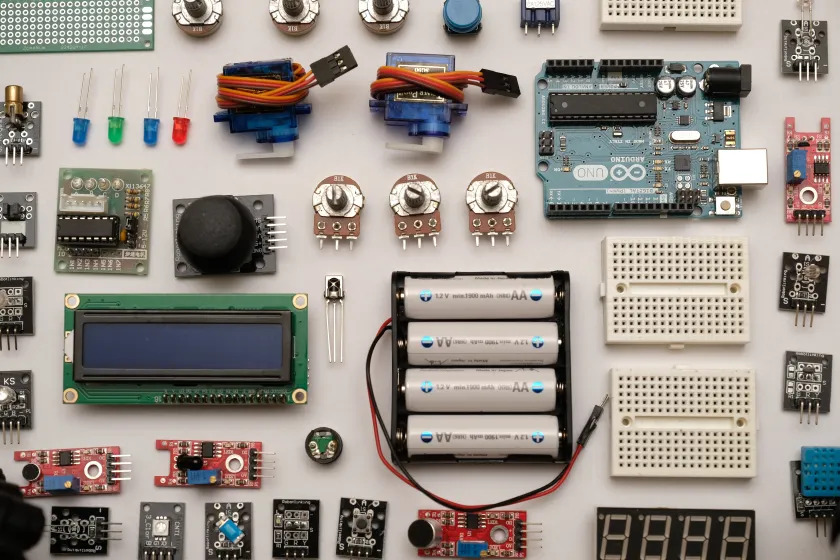

---
title: Welcome

# EGR 314 - Embedded System Design Project II

## STEM Weather Station Project

**Team Number:** 303  

**Team Members:** Cade Clonts, Tyler Dean, Jahmel Garduno, Daniel Resnick

**Preparation Date:** Febuary 21, 2025  

**Semester and Year:** Spring 2025  

**University:** Arizona State University 

**Professor:** K. Nichols

### __Team Role__
My subsystem for this project is the sensor subsystem. We intend to mimic a weather station so we are interested in sensing any combination of temperature, humidity, pressure, or wind speed. Once the data has been read using a PIC microcontroler it will be transmitted to the HMI subsystem so that it can be displayed to the user. this communication will be sent through UART.

### __Links__
Name | Link
-----|------------
Team Website   | [link](https://egr314-2025-s-303.github.io/EGR314-2025-S-303/)
Cade Clonts   | [link](https://cclonts2.github.io/)
Tyler Dean | [link](https://ty-357.github.io/)
Jahmel Garduno | [link](https://jahmelg10.github.io/)
Daniel Resnick | [link](https://drez85.github.io/)

### __My Assignments__
Assignment | Link
-----|------------
Compontent Selection | [link](https://ty-357.github.io/docs/componentselection.io/)
