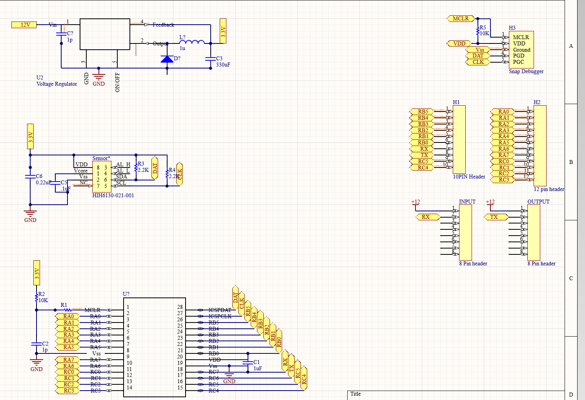
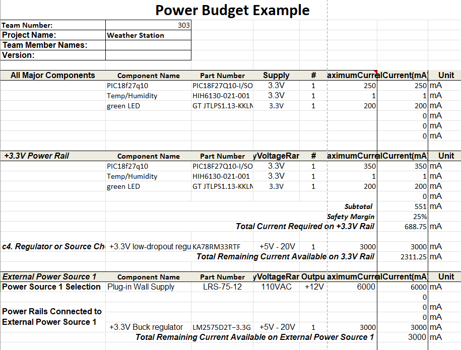

This is the current version of my sensor subsytem the 8 pin header is apart of our teams daisy chain. on that chain 12 volts of power will be supplied to my subsystem. This will then be regulated by a the NCV2575D2T-ADJ and turned into 3.3 volts to be used by each component. This 3.3 Volts powers both the PIC18F47Q10 microcontroller and the HIH6031-021-001 sensor. Additional headers will be connected to the microcontrollers excess input/output to allow for future additional components and debugging purposes.

Power Budget

PCB schematic
Future Item.
